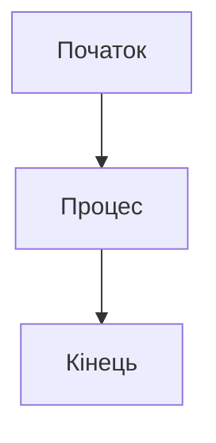

# TODO: Генерація навчальних матеріалів за допомогою ШІ

## Загальні інструкції

Цей документ містить інструкції для генерації навчальних матеріалів курсу "Хмарні технології інформаційних систем" за допомогою систем штучного інтелекту.

## Вимоги до генерації

### Загальні принципи
- **Мова**: Українська (академічний стиль)
- **Формат**: Markdown для конспектів, reveal.js/LaTeX Beamer для слайдів
- **Підхід**: Теоретичні основи з практичними прикладами AWS
- **Стиль**: Академічний, без маркетингових формулювань
- **Структура**: Чітка логічна послідовність матеріалу

### Компоненти для кожної лекції

Для кожної лекції необхідно створити:

1. **Конспект лекції** (`lecture-XX/notes.md`)
   - Детальний текстовий виклад матеріалу
   - Теоретичні основи (60-70%)
   - Практичні приклади AWS (30-40%)
   - Діаграми та ілюстрації (в форматі Mermaid або PlantUML)
   - Посилання на додаткові ресурси

2. **Слайди** (`lecture-XX/slides.md`)
   - Лаконічна презентація ключових концепцій
   - 20-30 слайдів на лекцію
   - Візуальні елементи та схеми
   - Приклади коду (якщо необхідно)

3. **Список літератури** (`lecture-XX/references.md`)
   - Академічні джерела
   - Офіційна документація
   - Наукові статті

## План генерації лекцій

### Лекція 1: Вступ до хмарних обчислень

**Промпт для ШІ:**
```
Створи академічний конспект лекції українською мовою на тему "Вступ до хмарних обчислень". 

Структура:
1. Історична еволюція обчислень (від мейнфреймів до хмар)
2. Визначення хмарних обчислень за NIST
3. П'ять ключових характеристик хмарних систем
4. Переваги та виклики хмарних технологій
5. Огляд AWS як референсної платформи

Вимоги:
- Академічний стиль викладу
- Теоретичні основи з поясненням концепцій
- AWS як приклад реалізації (не реклама)
- Діаграми еволюції технологій (Mermaid)
- Обсяг: 3000-4000 слів
```

### Лекція 2: Моделі обслуговування

**Промпт для ШІ:**
```
Створи академічний конспект лекції українською мовою на тему "Моделі обслуговування хмарних систем".

Структура:
1. Теоретичні основи сервісних моделей
2. Infrastructure as a Service (IaaS): концепція та архітектура
3. Platform as a Service (PaaS): абстракція та застосування
4. Software as a Service (SaaS): мультитенантність та дистрибуція
5. Порівняльний аналіз моделей (таблиця)
6. Приклади AWS: EC2 (IaaS), Elastic Beanstalk (PaaS), WorkSpaces (SaaS)

Вимоги:
- Фокус на архітектурних відмінностях
- Критерії вибору моделі для різних сценаріїв
- Діаграми архітектури (Mermaid)
- Обсяг: 3500-4500 слів
```

### Лекція 3: Моделі розгортання

**Промпт для ШІ:**
```
Створи академічний конспект лекції українською мовою на тему "Моделі розгортання хмарних систем".

Структура:
1. Публічні хмари: архітектура та характеристики
2. Приватні хмари: випадки використання
3. Гібридні хмари: інтеграція та оркестрація
4. Мультихмарні стратегії
5. Критерії вибору моделі розгортання
6. Приклади AWS: публічна хмара AWS, AWS Outposts, гібридні рішення

Вимоги:
- Аналіз компромісів між моделями
- Аспекти безпеки та комплаєнсу
- Обсяг: 3000-3500 слів
```

### Лекція 4: Архітектура хмарних систем

**Промпт для ШІ:**
```
Створи академічний конспект лекції українською мовою на тему "Архітектура хмарних систем".

Структура:
1. Принципи розподілених систем
2. CAP-теорема та її наслідки
3. Мікросервісна архітектура: теорія та практика
4. Serverless computing: парадигма та застосування
5. Архітектурні патерни хмарних систем
6. Приклади AWS: архітектурні рішення та best practices

Вимоги:
- Теоретичні основи розподілених систем
- Математичні моделі (де доречно)
- Діаграми архітектурних патернів
- Обсяг: 4000-5000 слів
```

### Лекція 5: Віртуалізація та контейнеризація

**Промпт для ШІ:**
```
Створи академічний конспект лекції українською мовою на тему "Віртуалізація та контейнеризація".

Структура:
1. Теоретичні основи віртуалізації
2. Гіпервізори: типи та архітектура
3. Контейнерні технології: ізоляція та оркестрація
4. Порівняння віртуальних машин та контейнерів
5. Kubernetes: архітектура та концепції
6. Приклади AWS: EC2, ECS, EKS, Fargate

Вимоги:
- Низькорівневі деталі технологій
- Аналіз продуктивності
- Обсяг: 4000-4500 слів
```

### Лекція 6: Зберігання даних у хмарі

**Промпт для ШІ:**
```
Створи академічний конспект лекції українською мовою на тему "Зберігання даних у хмарних системах".

Структура:
1. Типологія систем зберігання: об'єктне, блокове, файлове
2. Розподілені файлові системи
3. NoSQL та NewSQL бази даних
4. Consistency models: eventual, strong consistency
5. Стратегії резервного копіювання
6. Приклади AWS: S3, EBS, EFS, RDS, DynamoDB, Aurora

Вимоги:
- Теорія розподілених сховищ
- Алгоритми консистентності
- Обсяг: 4500-5000 слів
```

### Лекція 7: Мережеві аспекти хмарних систем

**Промпт для ШІ:**
```
Створи академічний конспект лекції українською мовою на тему "Мережеві аспекти хмарних систем".

Структура:
1. Віртуальні приватні хмари (VPC)
2. Програмно-визначені мережі (SDN)
3. Балансування навантаження: алгоритми та стратегії
4. Content Delivery Networks: принципи роботи
5. Мережева безпека та сегментація
6. Приклади AWS: VPC, ELB, Route 53, CloudFront

Вимоги:
- Мережеві протоколи та топології
- Алгоритми маршрутизації
- Обсяг: 3500-4000 слів
```

### Лекція 8: Безпека хмарних систем

**Промпт для ШІ:**
```
Створи академічний конспект лекції українською мовою на тему "Безпека хмарних систем".

Структура:
1. Моделі відповідальності за безпеку (Shared Responsibility Model)
2. Ідентифікація та аутентифікація: теорія та протоколи
3. Контроль доступу: RBAC, ABAC
4. Шифрування даних: at rest, in transit
5. Комплаєнс та сертифікація
6. Приклади AWS: IAM, KMS, CloudTrail, Security Groups

Вимоги:
- Криптографічні основи
- Протоколи безпеки
- Обсяг: 4000-4500 слів
```

### Лекція 9: Масштабованість та відмовостійкість

**Промпт для ШІ:**
```
Створи академічний конспект лекції українською мовою на тему "Масштабованість та відмовостійкість хмарних систем".

Структура:
1. Теорія масштабованості: горизонтальне vs вертикальне
2. Патерни високої доступності
3. Disaster Recovery: стратегії та RTO/RPO
4. Fault tolerance: механізми та техніки
5. Chaos Engineering: принципи
6. Приклади AWS: Auto Scaling, Multi-AZ, Multi-Region

Вимоги:
- Математичні моделі доступності
- SLA та метрики
- Обсяг: 4000-4500 слів
```

### Лекція 10: Моніторинг та оптимізація

**Промпт для ШІ:**
```
Створи академічний конспект лекції українською мовою на тему "Моніторинг та оптимізація хмарних систем".

Структура:
1. Системи моніторингу: метрики, логи, траси
2. Observability: концепція та інструменти
3. Performance tuning: методології
4. Cost optimization: стратегії та best practices
5. Capacity planning: прогнозування та планування
6. Приклади AWS: CloudWatch, X-Ray, Cost Explorer, Trusted Advisor

Вимоги:
- Методи аналізу продуктивності
- Економічні моделі
- Обсяг: 3500-4000 слів
```

## План генерації практичних робіт

### Практична робота 1: Розгортання базової хмарної інфраструктури

**Промпт для ШІ:**
```
Створи інструкції для практичної роботи українською мовою на тему "Розгортання базової хмарної інфраструктури".

Структура:
1. Мета роботи та очікувані результати
2. Теоретична частина (короткий огляд)
3. Завдання:
   - Налаштування VPC та підмереж
   - Створення обчислювальних ресурсів (EC2)
   - Конфігурація груп безпеки
   - Тестування підключення
4. Контрольні питання
5. Критерії оцінювання

Вимоги:
- Покрокові інструкції
- Пояснення кожного кроку
- Обсяг: 2000-2500 слів
```

### Практична робота 2: Проектування масштабованого застосунку

**Промпт для ШІ:**
```
Створи інструкції для практичної роботи українською мовою на тему "Проектування масштабованого застосунку".

Структура:
1. Мета роботи та очікувані результати
2. Теоретична частина (паттерни масштабування)
3. Завдання:
   - Налаштування Load Balancer
   - Конфігурація Auto Scaling Group
   - Моніторинг метрик
   - Тестування під навантаженням
4. Контрольні питання
5. Критерії оцінювання

Вимоги:
- Діаграми архітектури
- Практичні приклади конфігурації
- Обсяг: 2500-3000 слів
```

## План генерації лабораторних робіт

### Лабораторна робота 1: Дослідження моделей обслуговування

**Промпт для ШІ:**
```
Створи завдання для лабораторної роботи українською мовою на тему "Дослідження моделей обслуговування".

Структура:
1. Мета роботи
2. Теоретичні відомості
3. Завдання:
   - Порівняльний аналіз IaaS, PaaS, SaaS
   - Розгортання застосунку на різних рівнях абстракції
   - Вимірювання метрик (складність, час, вартість)
   - Аналіз результатів
4. Питання для дослідження
5. Вимоги до звіту

Обсяг: 2500-3000 слів
```

### Лабораторна робота 2: Архітектура та віртуалізація

**Промпт для ШІ:**
```
Створи завдання для лабораторної роботи українською мовою на тему "Архітектура та віртуалізація".

Структура:
1. Мета роботи
2. Теоретичні відомості
3. Завдання:
   - Проектування мікросервісної архітектури
   - Робота з віртуальними машинами
   - Розгортання контейнерів
   - Порівняння продуктивності
4. Питання для дослідження
5. Вимоги до звіту

Обсяг: 2500-3000 слів
```

### Лабораторна робота 3: Сховища даних та бази даних

**Промпт для ШІ:**
```
Створи завдання для лабораторної роботи українською мовою на тему "Сховища даних та бази даних".

Структура:
1. Мета роботи
2. Теоретичні відомості
3. Завдання:
   - Налаштування об'єктного сховища (S3)
   - Робота з реляційними БД (RDS)
   - Імплементація NoSQL рішення (DynamoDB)
   - Порівняльний аналіз
4. Питання для дослідження
5. Вимоги до звіту

Обсяг: 2500-3000 слів
```

### Лабораторна робота 4: Безпека та моніторинг

**Промпт для ШІ:**
```
Створи завдання для лабораторної роботи українською мовою на тему "Безпека та моніторинг".

Структура:
1. Мета роботи
2. Теоретичні відомості
3. Завдання:
   - Налаштування політик IAM
   - Конфігурація груп безпеки та NACL
   - Моніторинг за допомогою CloudWatch
   - Аналіз логів та метрик
4. Питання для дослідження
5. Вимоги до звіту

Обсяг: 2500-3000 слів
```

## Формат слайдів

Для генерації слайдів використовувати reveal.js формат:

```markdown
---
title: Назва лекції
theme: white
transition: slide
---

# Назва лекції
## Підзаголовок

---

## Слайд 1
- Пункт 1
- Пункт 2

---

## Слайд з діаграмою


```

## Загальні рекомендації для промптів ШІ

1. **Контекст**: Завжди вказуйте, що це академічний курс для студентів ВНЗ
2. **Мова**: Українська, академічний стиль
3. **Баланс**: 60-70% теорія, 30-40% практика (AWS)
4. **Структура**: Логічна послідовність від простого до складного
5. **Візуалізація**: Використання діаграм Mermaid/PlantUML
6. **Посилання**: Академічні джерела, не маркетингові матеріали
7. **Термінологія**: Українські терміни з англійськими еквівалентами в дужках

## Черговість генерації

1. Спочатку створити конспекти всіх 10 лекцій
2. Потім слайди для кожної лекції
3. Після цього практичні роботи
4. Нарешті лабораторні роботи

## Перевірка якості

Після генерації кожного компоненту перевірити:
- [ ] Відповідність академічному стилю
- [ ] Правильність української мови
- [ ] Баланс теорії та практики
- [ ] Відсутність маркетингових формулювань
- [ ] Наявність діаграм та ілюстрацій
- [ ] Логічність структури матеріалу
- [ ] Коректність технічних термінів
