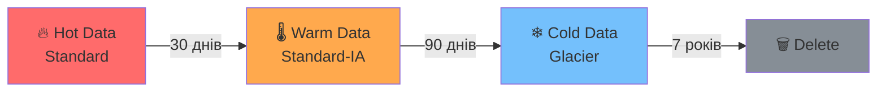

# Лекція 6: Зберігання даних та життєвий цикл

<!-- reveal.js presentation -->
<!-- Usage: open with reveal.js or compatible Markdown presenter -->

---

## Agenda

1. Типи зберігання даних
2. Object Storage в деталях
3. Data Lifecycle
4. Backup vs Archive
5. CAP теорема
6. Compliance: GDPR та data residency
7. AWS: S3, EBS, EFS
8. Security & Cost Optimization

---

## Де живуть ваші дані?

```
┌──────────────────────────────────────────┐
│           Типи Storage                   │
│                                          │
│  📦 Object   — S3, GCS, Azure Blob       │
│  💾 Block    — EBS, SAN, NVMe            │
│  📂 File     — EFS, NFS, SMB             │
└──────────────────────────────────────────┘
```

> **Правило**: вибір типу storage = вибір архітектури системи

---

## Object / Block / File — порівняння

| Критерій        | Object     | Block      | File        |
|-----------------|------------|------------|-------------|
| Протокол        | HTTP/S3    | iSCSI/NVMe | NFS/SMB     |
| Метадані        | Багаті     | Мінімальні | Обмежені    |
| Scalability     | ∞          | Обмежена   | Обмежена    |
| Latency         | Висока     | Низька     | Середня     |
| Use case        | Backup/CDN | DB/OS disk | Shared dirs |

---

## Коли що використовувати?

```
Потрібен shared доступ між EC2?
  └─► File Storage (EFS)

Потрібна БД або ОС диск?
  └─► Block Storage (EBS)

Файли, бекапи, статика, логи?
  └─► Object Storage (S3)
```

> **Tip**: 90% cloud workloads = S3 + EBS combo

---

## Object Storage: Ключова концепція

```
Bucket: my-app-data
  └─ Key: logs/2024/01/app.log   → Object + Metadata
  └─ Key: images/logo.png        → Object + Metadata
  └─ Key: backups/db-2024-01.sql → Object + Metadata
```

**Характеристики:**
- Плоска namespace (ієрархія — ілюзія)
- Унікальний ключ в межах bucket
- Необмежена кількість об'єктів
- HTTP endpoint для кожного об'єкта

---

## S3: Amazon Simple Storage Service

```
┌─────────────────────────────────────────┐
│  S3 Storage Classes                     │
│                                         │
│  🔥 Standard          → часто           │
│  🌡 Standard-IA       → рідко           │
│  ❄ Glacier Instant   → дуже рідко      │
│  🧊 Glacier Flexible  → архів (minutes) │
│  🏔 Glacier Deep      → архів (hours)   │
│  🧠 Intelligent-Tiering → авто          │
└─────────────────────────────────────────┘
```

---

## S3 Storage Classes: Cost vs Access

```
Вартість зберігання ($) ↓
│
│  Standard ──────────────────────────────● дорого, швидко
│  Standard-IA ────────────────────●
│  Glacier Instant ──────────●
│  Glacier Flexible ─────●
│  Glacier Deep ─────●                     дешево, повільно
│
└──────────────────────────────────────────► Час доступу
   мс           секунди         години
```

---

## Data Lifecycle: Hot → Warm → Cold



**Принцип:** Автоматизуй переміщення даних через lifecycle policies

---

## S3 Lifecycle Policy — приклад

```json
{
  "Rules": [{
    "Status": "Enabled",
    "Transitions": [
      { "Days": 30,  "StorageClass": "STANDARD_IA" },
      { "Days": 90,  "StorageClass": "GLACIER" }
    ],
    "Expiration": {
      "Days": 2555
    }
  }]
}
```

> **Результат:** Автоматичне збереження до 70% вартості storage

---

## S3 Versioning

```
без versioning:
  upload(logo.png) → перезаписує попередній

з versioning:
  upload(logo.png v1) → ID: abc123
  upload(logo.png v2) → ID: def456  ← current
  upload(logo.png v3) → ID: ghi789  ← current
  
  GET logo.png       → ghi789 (latest)
  GET logo.png?versionId=abc123 → v1
```

**Захист від:**
- Випадкового видалення
- Людської помилки
- Ransomware атак

---

## Block Storage: EBS

```
EC2 Instance
  ├── Root Volume (gp3, 20GB) ← OS
  ├── Data Volume  (gp3, 100GB) ← App data
  └── Log Volume   (st1, 500GB) ← Logs
```

**EBS типи:**
| Тип   | IOPS      | Latency | Use case          |
|-------|-----------|---------|-------------------|
| gp3   | до 16k    | мс      | General purpose   |
| io2   | до 64k    | <1мс    | Critical DB       |
| st1   | throughput| мс      | Big data, logs    |
| sc1   | low cost  | мс      | Cold storage      |

---

## EBS vs Instance Store

```
                EBS              Instance Store
Persistence:   ✅ Так            ❌ Ephemeral
Stop/Start:    ✅ Зберігається   ❌ Дані втрачаються
Snapshot:      ✅ Так            ❌ Ні
Performance:   ⚡ Висока         ⚡⚡ Вища (NVMe local)
Cost:          💰 Платна         🆓 Включена
```

> **Правило:** Stateful data → EBS. Тимчасовий кеш/scratch → Instance Store

---

## EBS Snapshots

```
┌──────────────────────────────────────────┐
│  EBS Snapshot Incremental Model          │
│                                          │
│  Snap 1 (full): ████████████  10GB      │
│  Snap 2 (incr): ████           3GB      │
│  Snap 3 (incr): ██             1GB      │
│                                          │
│  Всього збережено: 14GB (не 30GB!)      │
└──────────────────────────────────────────┘
```

- Зберігаються в S3 (managed)
- Можна копіювати між regions
- Основа для AMI (Golden Images)

---

## File Storage: EFS

```
                    AZ-A          AZ-B
                     │             │
  EC2-1 ─────────── EFS ──────── EC2-2
  EC2-2 ────────────╯            EC2-3
  
  NFS mount: /mnt/efs
  Shared filesystem для всіх instances
```

**Коли використовувати EFS:**
- Shared config / content між instances
- CMS (WordPress, Drupal)
- ML training data (shared read)
- CI/CD build caches

---

## Backup vs Archive

```
               Backup                    Archive
──────────────────────────────────────────────────
Мета:       Відновлення системи      Довгострокове збереження
RPO:        Години/дні               Не актуально
RTO:        Хвилини/години           Години/дні
Термін:     Тижні/місяці             Роки/десятиліття
Cost:       Середня                  Дуже низька
Access:     Часто                    Рідко/ніколи
Приклад:    EBS snapshot             Glacier Deep Archive
```

> **Ключова різниця:** Backup = ви плануєте використовувати. Archive = regulatory compliance.

---

## CAP Теорема

```
         Consistency
              △
             /|\
            / | \
           /  |  \
          /   |   \
         /    |    \
CA ─────╱─────┼─────╲───── CP
       /      │      \
      /   ⚡  │  ⚡   \
     /        │        \
    └──────────┴──────────┘
         Availability   Partition
                        Tolerance
```

**В реальному distributed system:** P завжди присутня → виберіть C або A

---

## CAP: Практичне застосування

```
CP системи (Consistency + Partition):
  → Банківські транзакції
  → Інвентаризація (stock levels)
  → Приклад: HBase, Zookeeper

AP системи (Availability + Partition):
  → DNS
  → Shopping cart
  → Social media likes
  → Приклад: DynamoDB (eventually consistent mode), CouchDB
```

> **S3 сьогодні:** Strongly consistent (з листопада 2020) — CP для більшості операцій

---

## GDPR та Data Residency

```
🇪🇺 GDPR Ключові вимоги:
  ├── Право на видалення ("right to be forgotten")
  ├── Дані ЄС не можуть покидати ЄС без захисту
  ├── Шифрування персональних даних
  └── Data breach notification ≤ 72 год

AWS Region вибір:
  ├── EU дані → eu-west-1, eu-central-1
  ├── US дані → us-east-1, us-west-2
  └── Мультирегіональність → складніше з GDPR
```

---

## Data Residency в AWS

```
┌─────────────────────────────────────────────┐
│ Гарантії AWS:                               │
│  ✅ Дані НЕ переміщуються між regions       │
│     без явного дозволу клієнта              │
│                                             │
│ Ваша відповідальність:                      │
│  ⚠️  Не replicat до неправильного region    │
│  ⚠️  Контролювати cross-region transfers    │
│  ⚠️  Логи та метадані теж є "даними"        │
└─────────────────────────────────────────────┘
```

**Інструменти:** AWS Config, SCPs (Service Control Policies)

---

## S3 Security: Захист даних

```
Рівні захисту S3:

1. Block Public Access ← завжди ON за замовчуванням
   
2. Bucket Policy:
   { "Effect": "Deny",
     "Principal": "*",
     "Action": "s3:GetObject",
     "Condition": { "Bool": 
       {"aws:SecureTransport": "false"} } }

3. IAM Policies: хто може що робити

4. Encryption: SSE-S3 / SSE-KMS / SSE-C
```

---

## S3 Encryption Options

```
SSE-S3    → AWS manages keys (AES-256)
            Найпростіше, безкоштовно
            
SSE-KMS   → AWS KMS manages keys
            Audit trail в CloudTrail
            Ротація ключів
            💰 Невелика вартість за API calls

SSE-C     → Client manages keys
            Максимальний контроль
            Висока складність

Client-side → Encrypt before upload
              Найвища безпека
              Складна реалізація
```

> **Рекомендація:** SSE-KMS для чутливих даних, SSE-S3 для решти

---

## Encryption in Transit

```
❌ Погано:
  HTTP://my-bucket.s3.amazonaws.com/data.csv
  
✅ Добре:
  HTTPS://my-bucket.s3.amazonaws.com/data.csv

Примусити HTTPS через Bucket Policy:
{
  "Condition": {
    "Bool": {
      "aws:SecureTransport": "false"
    }
  },
  "Effect": "Deny"
}
```

---

## S3 Intelligent-Tiering

```
┌─────────────────────────────────────────────┐
│  Intelligent-Tiering автоматично переміщує  │
│  об'єкти між класами зберігання:             │
│                                             │
│  Frequent Access tier (default)             │
│       ↕ (30 днів без доступу)               │
│  Infrequent Access tier                     │
│       ↕ (90 днів без доступу)               │
│  Archive Instant Access tier                │
│       ↕ (manual activation)                 │
│  Archive Access / Deep Archive tier         │
└─────────────────────────────────────────────┘
```

**Ідеально для:** даних з непередбачуваним access pattern

---

## Cost Optimization: Storage

```
Типові заощадження:

S3 Lifecycle policies:    💰 40-70% вартості
S3 Intelligent-Tiering:   💰 20-40% вартості
EBS: gp3 замість gp2:     💰 20% дешевше (і краще!)
EBS Snapshot cleanup:     💰 до 30% вартості EBS

Реальний приклад:
  Before: 100TB S3 Standard → $2,300/міс
  After:  Lifecycle → IA → Glacier → $500/міс
  Savings: $1,800/міс = $21,600/рік
```

---

## Практичний приклад: Lifecycle Policy

**Задача:** Логи застосунку, 1TB/місяць

```
Правила:
  0–30 днів:   Standard         (гарячі логи)
  30–90 днів:  Standard-IA      (теплі логи)
  90–365 днів: Glacier Instant  (холодні логи)
  > 365 днів:  Delete           (або Glacier Deep для compliance)

AWS CLI:
aws s3api put-bucket-lifecycle-configuration \
  --bucket my-logs-bucket \
  --lifecycle-configuration file://lifecycle.json
```

---

## Архітектурний паттерн: Data Lake

```
┌────────────────────────────────────────────────┐
│                   Data Lake (S3)               │
│                                                │
│  Raw Zone         Processed Zone    Curated    │
│  (Landing)   →    (Cleaned)    →    (Business) │
│  s3://raw/        s3://proc/        s3://cur/  │
│                                                │
│  Storage class: Standard   Standard-IA  IA/Glacier
└────────────────────────────────────────────────┘
         ↓                ↓               ↓
       Glue ETL        Athena         QuickSight
```

---

## Anti-Patterns: Що НЕ робити

```
❌ Зберігати секрети в S3 без шифрування
❌ Публічний доступ до bucket без потреби
❌ Один S3 bucket для всього (prod/dev/test)
❌ Не версіонувати критичні дані
❌ Ігнорувати lifecycle policies (= гроші на вітер)
❌ EBS для статичних файлів (є S3)
❌ EFS для БД workloads (є EBS)
❌ Не робити EBS snapshot перед змінами
❌ Залишати unused EBS volumes
```

---

## Checklist: Production-Ready Storage

```
S3:
  ✅ Block Public Access увімкнено
  ✅ Versioning увімкнено (для критичних buckets)
  ✅ Lifecycle policy налаштована
  ✅ Encryption at rest (SSE-KMS або SSE-S3)
  ✅ Bucket policy: deny non-HTTPS
  ✅ Access logging увімкнено
  
EBS:
  ✅ Snapshot schedule (щодня/щотижня)
  ✅ Encryption увімкнено
  ✅ gp3 замість gp2
  ✅ Cleanup unused volumes
```

---

## Ключові висновки

```
1. Storage = архітектурне рішення
   Object → S3, Block → EBS, File → EFS

2. Автоматизуй lifecycle
   Hot → Warm → Cold → Delete

3. Backup ≠ Archive
   Різні цілі, різні інструменти

4. CAP: у distributed системах P завжди є
   Обираєш між C та A

5. GDPR: дані в потрібному region + encryption

6. Security за замовчуванням
   Block Public Access, шифрування, HTTPS only
```

---

## Ресурси для глибшого вивчення

- 📘 [AWS S3 Documentation](https://docs.aws.amazon.com/s3/)
- 📘 [AWS EBS User Guide](https://docs.aws.amazon.com/ebs/)
- 📘 [AWS EFS User Guide](https://docs.aws.amazon.com/efs/)
- 🎓 [AWS Storage Learning Path](https://aws.amazon.com/training/learn-about/storage/)
- 📄 [S3 Best Practices](https://docs.aws.amazon.com/AmazonS3/latest/userguide/security-best-practices.html)
- 📄 [CAP Theorem Revisited (Blog)](https://robertgreiner.com/cap-theorem-revisited/)
- 🔐 [GDPR Compliance on AWS](https://aws.amazon.com/compliance/gdpr-center/)

---

## Питання для самоперевірки

1. У чому різниця між Object, Block та File storage?
2. Коли варто використовувати S3 Intelligent-Tiering?
3. Що відбудеться з даними на Instance Store після зупинки EC2?
4. Яку частину CAP теореми неможливо ігнорувати у distributed системі?
5. Як lifecycle policy допомагає зменшити витрати?
6. Які дані вважаються персональними за GDPR?
7. Чим відрізняється SSE-KMS від SSE-S3?

---

## Наступна лекція

### Лекція 7: Хмарні бази даних

```
Теми:
  - RDBMS vs NoSQL
  - ACID vs BASE
  - Scaling databases
  - AWS RDS, DynamoDB, Aurora
```

> **Підготовка:** Пригадайте основи SQL та поняття транзакцій
